# Architecture & State Diagrams

## Package Dependency Graph

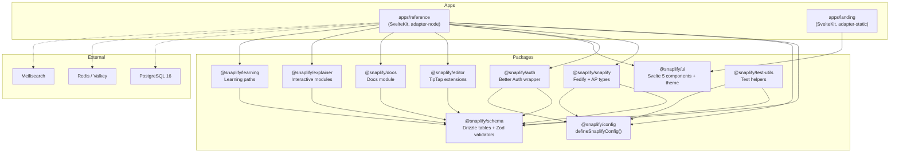

## Request Lifecycle

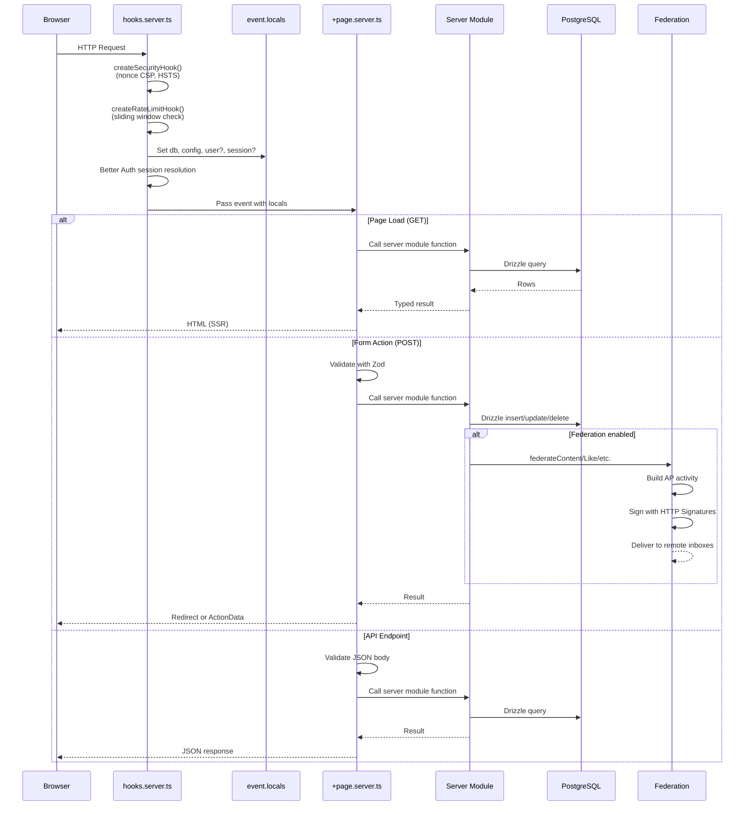

## Content Data Flow

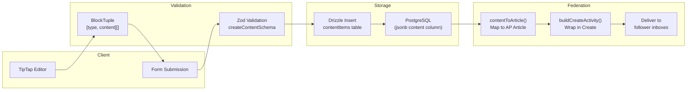

## State Machines

### Content Lifecycle

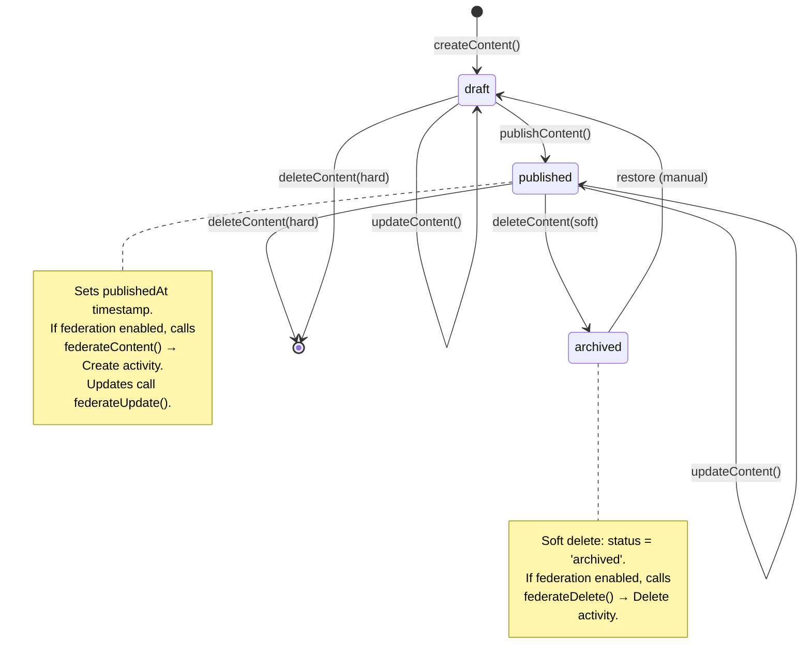

### Follow Relationship (Federation)

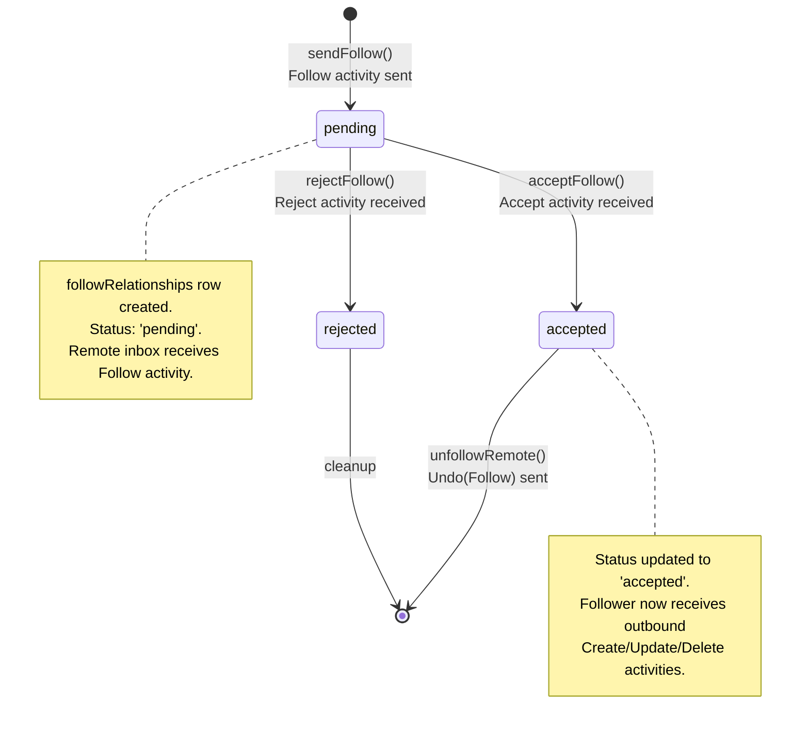

### Activity Status (Federation)

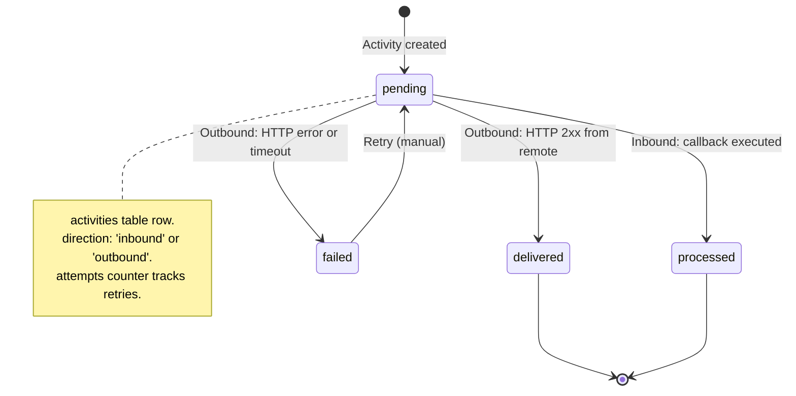

### Enrollment (Learning Paths)

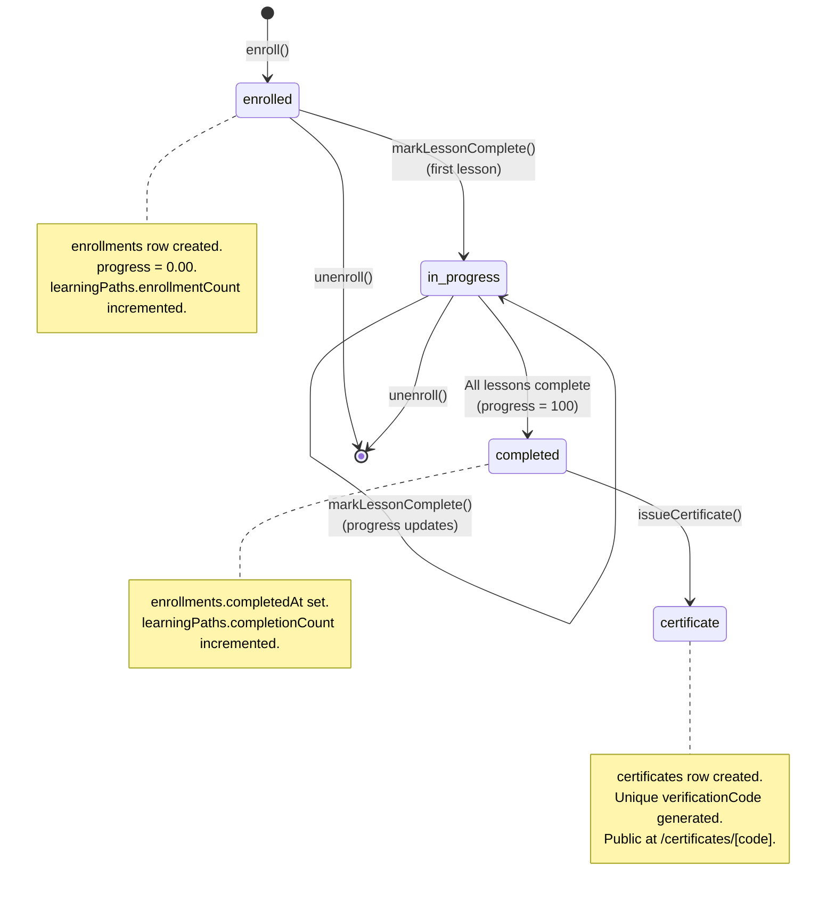

### Community Membership

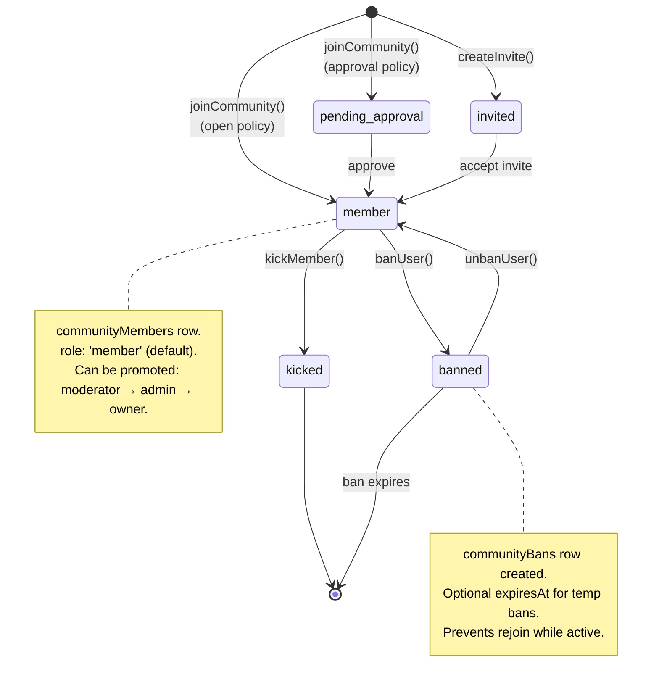

### Report Lifecycle

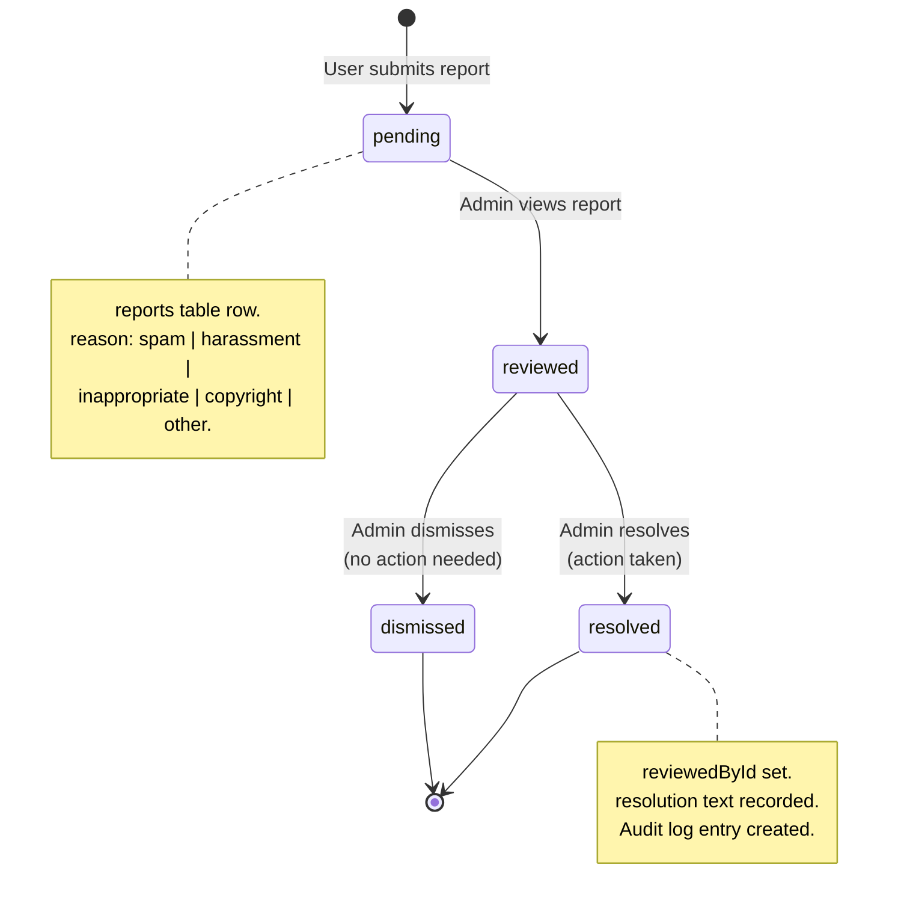

## Database Entity Relationship Overview

```mermaid
erDiagram
    users ||--o{ sessions : has
    users ||--o{ accounts : has
    users ||--o{ contentItems : authors
    users ||--o{ likes : creates
    users ||--o{ comments : writes
    users ||--o{ bookmarks : saves
    users ||--o{ follows : "follows/followed"
    users ||--o{ notifications : receives
    users ||--o{ communityMembers : joins
    users ||--o{ enrollments : enrolls
    users ||--o{ certificates : earns
    users ||--o{ federatedAccounts : "SSO links"
    users ||--o{ actorKeypairs : "has keypair"
    users ||--o{ reports : submits

    contentItems ||--o{ contentTags : tagged
    contentItems ||--o{ contentForks : forked
    tags ||--o{ contentTags : used

    communities ||--o{ communityMembers : has
    communities ||--o{ communityPosts : contains
    communities ||--o{ communityBans : enforces
    communities ||--o{ communityInvites : creates
    communities ||--o{ communityShares : shares

    communityPosts ||--o{ communityPostReplies : has

    learningPaths ||--o{ learningModules : contains
    learningModules ||--o{ learningLessons : contains
    learningPaths ||--o{ enrollments : tracks
    learningPaths ||--o{ certificates : awards

    docsSites ||--o{ docsVersions : versions
    docsVersions ||--o{ docsPages : contains
    docsVersions ||--o{ docsNav : "has nav"

    remoteActors ||--o{ activities : performs
    followRelationships }o--o{ users : connects
```

## Infrastructure Architecture

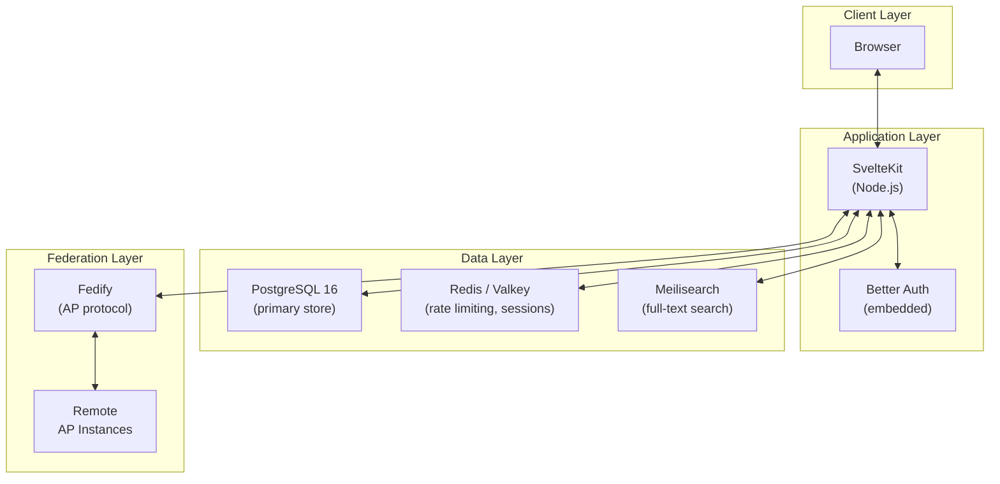
