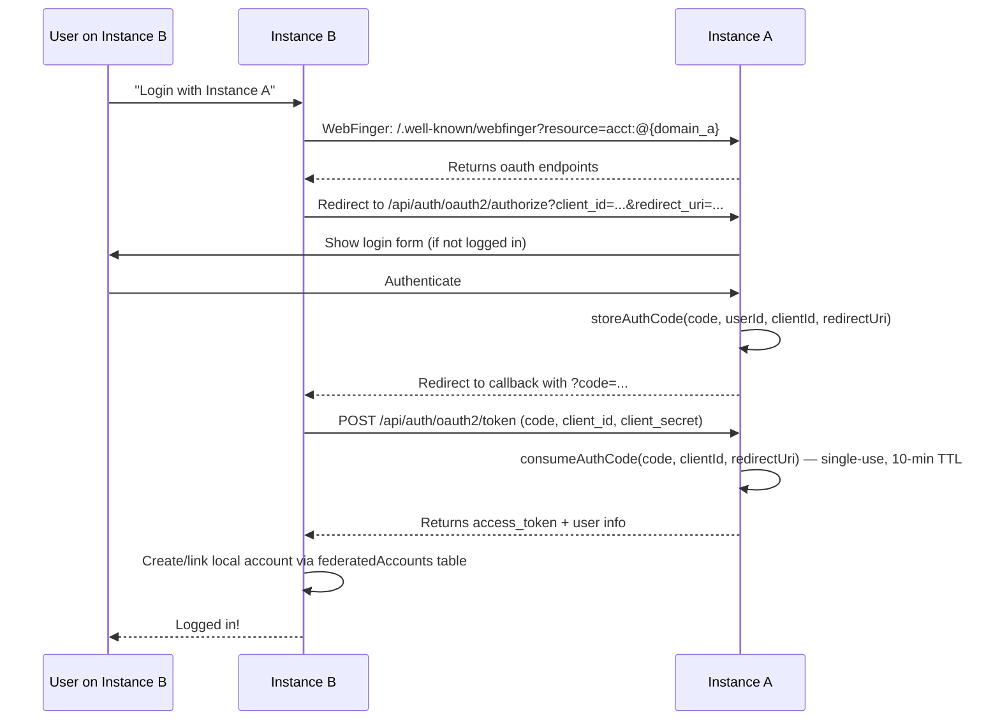

# Federation Guide

> v1 capabilities and limitations, OAuth2 SSO flow, endpoint reference, and answers to cross-publishing/mirroring questions.

---

## What Federation DOES Enable in v1

1. **Follow users across instances** — Mutual follow with Accept/Reject lifecycle
2. **See federated content** — When someone you follow publishes, a Create activity is logged
3. **Like content across instances** — Like activities are sent outbound
4. **Single sign-on** — OAuth2 SSO between trusted instances (Model B)
5. **Discover users** — WebFinger lookup (`@user@instance.com`)
6. **Actor profiles** — JSON-LD actor documents with public keys
7. **NodeInfo** — Instance metadata discovery

## What Federation Does NOT Enable in v1

1. **No remote content persistence** — Inbound Create/Update/Delete/Like/Announce are logged but NOT stored locally
2. **No cross-publishing** — Content has a single origin instance
3. **No server mirroring** — No content sync between instances
4. **No federated communities** — Communities are local-only (standing rule #5)
5. **No cross-instance community interaction** — Cannot join or post in remote communities
6. **No activity delivery** — Activities are logged in the `activities` table but not yet delivered to remote inboxes via HTTP
7. **No HTTP Signature signing on outbound requests** — Verification of inbound signatures is implemented

---

## FAQ: Cross-Publishing, Mirroring, and Cross-Site Interaction

### Can communities mirror projects/communities from another site?

**No.** Communities are local-only in v1 (standing rule #5). There is no AP Group support and no remote content persistence. Inbound Create/Update/Delete activities are stub handlers that log the activity but do not store the content locally.

### Can I publish projects to multiple sites?

**No.** Content has a single origin instance. Federation is outbound-only: when you publish locally, a Create activity (AP Article) is logged. There is no cross-posting or multi-origin storage mechanism.

### Can I interact with communities/hubs from different sites?

**No.** Communities are local to each instance. Users can follow remote *users* and like federated *content*, but cannot join or post in remote communities.

### Can I at server level say "this server mirrors that one"?

**No.** No mirroring feature exists. Inbound content is logged but not stored. Remote actor profiles are cached (24h TTL) in the `remoteActors` table, but content is not persisted.

### Can I OAuth with one site and cross-publish?

**Partially.** OAuth2 SSO (Model B) lets you authenticate on Instance A and create a linked account on Instance B via the `federatedAccounts` table. But this only creates an identity link — it does NOT enable cross-publishing. Each instance maintains its own content independently.

### What would need to be built for full federation?

These are all post-v1.0.0 features requiring significant protocol work:

1. **AP Group support** — For federated communities (`type: "Group"`)
2. **Inbound content persistence** — Store remote Articles/Notes locally
3. **Activity delivery** — Actually deliver outbound activities to remote inboxes via signed HTTP POST
4. **Cross-publishing API** — Publish to multiple origin instances
5. **Server mirroring protocol** — Full content sync between instances
6. **HTTP Signature signing** — Sign outbound requests with actor keypairs

---

## Federation Architecture

### Supported Activity Types (9)

| Activity | Direction | Implementation |
|----------|-----------|---------------|
| **Create** | Outbound | `federateContent()` → logged in activities table |
| **Create** | Inbound | `onCreate` callback → log only (stub) |
| **Update** | Outbound | `federateUpdate()` → logged |
| **Update** | Inbound | `onUpdate` callback → log only (stub) |
| **Delete** | Outbound | `federateDelete()` → logged |
| **Delete** | Inbound | `onDelete` callback → log only (stub) |
| **Follow** | Both | Full lifecycle: pending → accepted/rejected |
| **Accept** | Both | Updates followRelationship status |
| **Reject** | Both | Updates followRelationship status |
| **Undo** | Both | Deletes followRelationship (for Follow) |
| **Like** | Outbound | `federateLike()` → logged |
| **Like** | Inbound | `onLike` callback → log only (stub) |
| **Announce** | Inbound | `onAnnounce` callback → log only (stub) |

### Object Types

| AP Type | Snaplify Type | Builder |
|---------|--------------|---------|
| Article | project, article, guide, blog | `contentToArticle(item, author, domain)` |
| Note | comment, short post | `contentToNote(comment, author, domain, parentUri)` |
| Tombstone | deleted content | Via Delete activity |

### Actor Shape (Person)

```json
{
  "@context": "https://www.w3.org/ns/activitystreams",
  "type": "Person",
  "id": "https://hack.build/users/alice",
  "preferredUsername": "alice",
  "name": "Alice",
  "summary": "Maker and hacker",
  "url": "https://hack.build/@alice",
  "inbox": "https://hack.build/users/alice/inbox",
  "outbox": "https://hack.build/users/alice/outbox",
  "followers": "https://hack.build/users/alice/followers",
  "following": "https://hack.build/users/alice/following",
  "publicKey": {
    "id": "https://hack.build/users/alice#main-key",
    "owner": "https://hack.build/users/alice",
    "publicKeyPem": "-----BEGIN PUBLIC KEY-----\n..."
  },
  "endpoints": {
    "sharedInbox": "https://hack.build/inbox",
    "oauthAuthorizationEndpoint": "https://hack.build/api/auth/oauth2/authorize",
    "oauthTokenEndpoint": "https://hack.build/api/auth/oauth2/token"
  }
}
```

### Activity Example (Create Article)

```json
{
  "@context": "https://www.w3.org/ns/activitystreams",
  "type": "Create",
  "id": "https://hack.build/activities/uuid",
  "actor": "https://hack.build/users/alice",
  "object": {
    "@context": "https://www.w3.org/ns/activitystreams",
    "type": "Article",
    "id": "https://hack.build/project/my-robot",
    "attributedTo": "https://hack.build/users/alice",
    "name": "Building a Robot Arm",
    "content": "<p>Step by step guide...</p>",
    "url": "https://hack.build/project/my-robot",
    "published": "2026-03-10T00:00:00Z",
    "to": ["https://www.w3.org/ns/activitystreams#Public"],
    "cc": ["https://hack.build/users/alice/followers"]
  },
  "to": ["https://www.w3.org/ns/activitystreams#Public"],
  "cc": ["https://hack.build/users/alice/followers"]
}
```

---

## Federation Endpoints

| Endpoint | Method | Purpose |
|----------|--------|---------|
| `/.well-known/webfinger?resource=acct:{user}@{domain}` | GET | WebFinger discovery |
| `/.well-known/nodeinfo` | GET | NodeInfo discovery |
| `/nodeinfo/2.1` | GET | NodeInfo 2.1 document |
| `/users/[username]` | GET | Actor profile (content negotiation: `application/activity+json`) |
| `/users/[username]/followers` | GET | Followers OrderedCollection |
| `/users/[username]/following` | GET | Following OrderedCollection |
| `/users/[username]/outbox` | GET | Outbox (paginated, 20/page) |
| `/users/[username]/inbox` | POST | Per-user inbox (processes 9 activity types) |
| `/inbox` | POST | Shared inbox |

### Internal API Endpoints

| Endpoint | Method | Purpose | Auth |
|----------|--------|---------|------|
| `/api/federation/follow` | POST | Send follow `{remoteActorUri}` | Yes |
| `/api/federation/follow/[id]` | DELETE | Unfollow | Yes |
| `/api/federation/follow/[id]/accept` | POST | Accept follow request | Yes |
| `/api/federation/follow/[id]/reject` | POST | Reject follow request | Yes |

---

## OAuth2 SSO Flow (Model B)



### OAuth2 Setup

1. Register Instance B as an OAuth client on Instance A (creates `oauthClients` row)
2. Add Instance A's domain to Instance B's `auth.trustedInstances[]` config
3. User on Instance B clicks "Login with Instance A"
4. Standard OAuth2 authorization code flow with PKCE

### SSO Limitations

- Only creates an identity link — does NOT sync content
- Requires pre-registration of OAuth clients (manual process)
- Auth codes are in-memory (production should use Redis)
- No automatic account provisioning (user must complete signup on Instance B)

---

## Database Tables Used by Federation

| Table | Purpose |
|-------|---------|
| `remoteActors` | Cache of remote AP actor profiles (24h TTL) |
| `activities` | Log of all inbound/outbound AP activities |
| `followRelationships` | Federation-level follow state (pending/accepted/rejected) |
| `actorKeypairs` | RSA-2048 keypairs per user for HTTP Signatures |
| `federatedAccounts` | Links local users to remote AP actor identities |
| `oauthClients` | Registered OAuth2 clients (other Snaplify instances) |

---

## Inbox Processing

When an activity arrives at `/users/[username]/inbox` or `/inbox`:

1. Parse the JSON-LD activity body
2. Route to the appropriate `InboxCallbacks` handler based on `activity.type`
3. For Follow/Accept/Reject/Undo: Full implementation — updates `followRelationships` table
4. For Create/Update/Delete/Like/Announce: **Stub implementation** — logs the activity to the `activities` table with status `'processed'` but does NOT persist the content locally

```typescript
// v1 inbox callbacks
{
  onFollow: async (activity) => {
    // Insert followRelationship (pending), auto-accept in v1
  },
  onAccept: async (activity) => {
    // Update followRelationship → accepted
  },
  onReject: async (activity) => {
    // Update followRelationship → rejected
  },
  onUndo: async (activity) => {
    // Delete followRelationship (if Follow)
  },
  onCreate: async (activity) => {
    // LOG ONLY — does not store remote content
  },
  onUpdate: async (activity) => {
    // LOG ONLY
  },
  onDelete: async (activity) => {
    // LOG ONLY
  },
  onLike: async (activity) => {
    // LOG ONLY
  },
  onAnnounce: async (activity) => {
    // LOG ONLY
  },
}
```

---

## Federation Hook Pattern

Server modules call federation functions after mutations when the federation flag is enabled:

```typescript
// In content.ts
export async function onContentPublished(db, contentId, config) {
  if (!config.features.federation) return;
  await federateContent(db, contentId, config.instance.domain)
    .catch((err: unknown) => { console.error('[federation]', err); });
}
```

Key points:
- Always check `config.features.federation` first
- Always `.catch(...)` with `console.error` — federation failures must never break local operations, but errors are logged for observability
- Activities are logged to the `activities` table with status `'pending'`
- No actual HTTP delivery happens in v1 (activities remain in pending state)

---

## Federation Roadmap (Post-v1)

The following phases describe what needs to be built to achieve full federation. Each phase builds on previous work.

| Phase | What | Enables | Depends On | Complexity |
|-------|------|---------|------------|------------|
| F1 | HTTP Signature Signing (outbound) | Remote instances accept our activities | — | Small |
| F2 | Activity Delivery | Activities actually arrive at remote inboxes | F1 | Medium-Large |
| F3 | Inbound Content Persistence | Remote articles/notes in local feeds | — | Medium |
| F4 | Remote Content Interaction | Like/comment on remote content | F1, F2, F3 | Medium |
| F5 | AP Group Support | Federated communities | F1–F4 | Large |
| F6 | Cross-Publishing API | Publish to multiple origins | F1, F2, F8 | Medium-Large |
| F7 | Server Mirroring | Full content sync between instances | F1–F3, F6 | Large |
| F8 | OAuth2 Callback (consumer) | Complete cross-instance account linking | — | Small |

### F1 — HTTP Signature Signing (outbound)

**What it enables:** Remote instances will accept our outbound activities (Follow, Create, Like, etc.) because they can verify the sender's identity via HTTP Signatures.

**Schema changes:** None — `actorKeypairs` table already stores RSA-2048 keypairs per user.

**Functions to implement:**
- `signRequest(request: Request, actorKeypair: ActorKeypair, keyId: string): Request` in `packages/protocol/src/keypairs.ts`
- Update `federateContent()`, `federateUpdate()`, `federateDelete()`, `federateLike()` to sign outgoing requests

**Protocol work:** Implement HTTP Signatures draft-cavage-http-signatures-12 (the de facto ActivityPub standard). Sign `(request-target)`, `host`, `date`, and `digest` headers.

**Estimated complexity:** Small — the verification side already exists; signing is the mirror operation.

### F2 — Activity Delivery

**What it enables:** Activities actually arrive at remote inboxes instead of just being logged locally.

**Schema changes:**
- Add `deliveryStatus` column to `activities` table (`'pending' | 'delivered' | 'failed'`)
- Add `deliveryAttempts` and `lastDeliveryError` columns

**Functions to implement:**
- `deliverActivity(activity: Activity, targetInbox: string): Promise<void>` — HTTP POST with signed request
- `resolveInboxes(actorUri: string): Promise<string[]>` — Fetch remote actor to get inbox URL
- `deliverToFollowers(db: DB, actorId: string, activity: object): Promise<void>` — Fan out to all followers' inboxes
- Background job/queue for retry logic (Redis-backed)

**Protocol work:** Resolve follower inboxes via actor documents, use shared inbox optimization where available, implement exponential backoff for failed deliveries.

**Estimated complexity:** Medium-Large — requires queue infrastructure, retry logic, and follower inbox resolution.

**Depends on:** F1 (all outbound requests must be signed)

### F3 — Inbound Content Persistence

**What it enables:** Remote articles and notes appear in local feeds. Users can browse federated content without leaving their instance.

**Schema changes:**
- Add `remoteContent` table: `id`, `actorUri`, `objectUri`, `type`, `title`, `content`, `published`, `fetchedAt`, `raw` (JSON)
- Add index on `actorUri` for feed queries

**Functions to implement:**
- Update `onCreate` inbox callback to persist content to `remoteContent`
- Update `onUpdate` callback to update existing `remoteContent` rows
- Update `onDelete` callback to soft-delete `remoteContent` rows
- `listFederatedFeed(db: DB, userId: string): Promise<RemoteContentItem[]>` — aggregated feed from followed actors

**Protocol work:** Parse AP Article/Note objects, extract and sanitize HTML content, handle content addressing (public vs followers-only).

**Estimated complexity:** Medium — straightforward persistence but requires careful HTML sanitization and content addressing.

### F4 — Remote Content Interaction

**What it enables:** Users can like and comment on content from remote instances.

**Schema changes:**
- Add `remoteUri` column to `likes` table (nullable) — tracks which remote object was liked
- Add `remoteUri` column to `comments` table (nullable)

**Functions to implement:**
- `likeRemoteContent(db: DB, userId: string, remoteObjectUri: string): Promise<void>`
- `commentOnRemoteContent(db: DB, userId: string, remoteObjectUri: string, content: string): Promise<void>`
- Deliver Like/Create(Note) activities to the remote object's actor inbox

**Protocol work:** Construct proper Like and Create(Note with `inReplyTo`) activities, resolve the remote actor's inbox.

**Estimated complexity:** Medium

**Depends on:** F1 (signing), F2 (delivery), F3 (need to know what remote content exists)

### F5 — AP Group Support

**What it enables:** Federated communities — users on Instance A can join and participate in communities hosted on Instance B.

**Schema changes:**
- Add `apType` column to `communities` table (default `'Group'`)
- Add `remoteMembers` table for tracking remote community participants
- Add AP endpoints for Group actors (inbox, outbox, followers)

**Functions to implement:**
- `communityToGroup(community, domain): APGroup` — build Group actor document
- Group inbox handler — process Join, Leave, Create (posts) from remote users
- `federatePostToCommunity(db, postId, communityId): Promise<void>` — deliver posts to community followers
- Community WebFinger support (`@community-slug@instance`)

**Protocol work:** Implement FEP-1b12 (Groups) or Lemmy-compatible Group federation. Handle Group forwarding (community re-distributes posts to all members).

**Estimated complexity:** Large — significant protocol work, new actor type, group forwarding logic.

**Depends on:** F1–F4

### F6 — Cross-Publishing API

**What it enables:** Authors can publish content to multiple Snaplify instances simultaneously.

**Schema changes:**
- Add `contentOrigins` table: `contentId`, `instanceDomain`, `remoteId`, `syncStatus`
- Add `crossPublishTargets` user setting

**Functions to implement:**
- `crossPublish(db: DB, contentId: string, targetDomains: string[]): Promise<CrossPublishResult[]>`
- `syncContentUpdate(db: DB, contentId: string): Promise<void>` — propagate edits to all origins
- API endpoint: `POST /api/content/[id]/cross-publish`

**Protocol work:** Use OAuth2 tokens (from F8) to authenticate on remote instances, use their content creation API.

**Estimated complexity:** Medium-Large

**Depends on:** F1 (signing), F2 (delivery), F8 (OAuth2 for auth on remote instances)

### F7 — Server Mirroring

**What it enables:** Full content sync between instances — Instance B maintains a complete mirror of Instance A's public content.

**Schema changes:**
- Add `mirrorConfig` table: `id`, `sourceInstance`, `targetInstance`, `lastSyncAt`, `status`
- Add `mirroredContent` table linking local content to source

**Functions to implement:**
- `initMirror(db: DB, sourceInstance: string): Promise<void>` — initial full sync
- `syncMirror(db: DB, mirrorId: string): Promise<SyncResult>` — incremental sync
- `handleMirrorWebhook(db: DB, activity: Activity): Promise<void>` — real-time updates via AP
- Admin API: `POST /api/admin/mirrors`, `DELETE /api/admin/mirrors/[id]`

**Protocol work:** Combination of AP Collection pagination (initial sync) and real-time activity delivery (ongoing sync). Conflict resolution for bidirectional mirrors.

**Estimated complexity:** Large — requires pagination, conflict resolution, and reliable sync state management.

**Depends on:** F1–F3, F6

### F8 — OAuth2 Callback (consumer)

**What it enables:** Complete cross-instance account linking. Currently only the provider side (authorize + token endpoints) is implemented. This adds the consumer side so Instance B can complete the OAuth2 flow with Instance A.

**Schema changes:** None — `federatedAccounts` table already exists.

**Functions to implement:**
- `handleOAuthCallback(code: string, state: string): Promise<FederatedAccount>` — exchange code for token
- `refreshOAuthToken(federatedAccountId: string): Promise<void>`
- SvelteKit route: `GET /auth/callback/[instance]`

**Protocol work:** Standard OAuth2 authorization code flow with PKCE (consumer side). Store and refresh tokens.

**Estimated complexity:** Small — standard OAuth2 consumer implementation.
